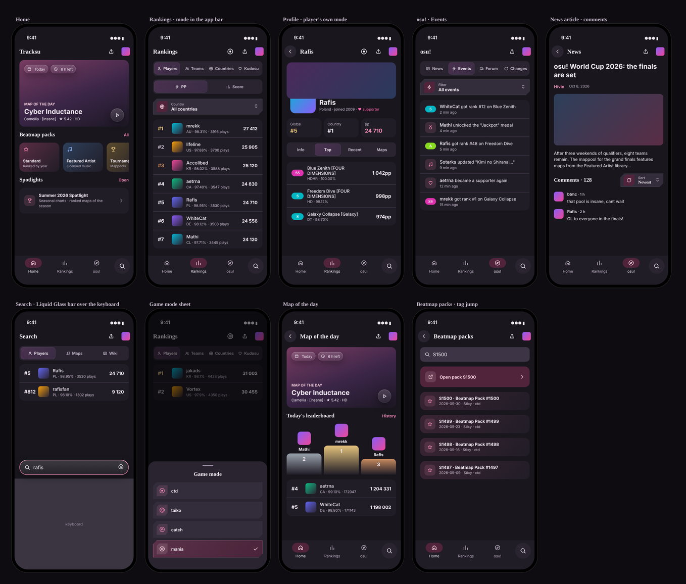

# Tracksu

[](https://flutter.dev/)
[](https://dart.dev/)
[](#platform-status)
[](LICENSE)

An unofficial client for exploring player statistics, rankings, beatmaps,
scores, comments and news from the [osu! API](https://osu.ppy.sh/docs/).
Built with [Flutter](https://flutter.dev/) (Dart) from a single codebase for
Android and iOS.

Tracksu is designed as a compact companion for osu! players who want to browse
the game's public data from an Android device. Most of the app is available
without signing in; osu! OAuth can optionally be used to open your own profile.

> [!IMPORTANT]
> Tracksu is under active reconstruction and is not currently distributed on
> Google Play. The old store listing was removed after its information became
> outdated and the original app depended on the deprecated osu! API v1.

## Features

### Audio previews

- Map cards, details, spotlights and result sheets place the player on their cover
  when the API supplies a preview URL. Supported osu!-hosted MP3 audio blocks and
  direct links in rich content use the same player with pause, seek, replay and retry.
- Only explicit Play requests audio; connection information lives in Settings.
  One track plays at a time; route changes stop it, interruptions/background pause
  it without automatic resume. Scrolling a news article keeps its active player.
- Completed MP3s reuse the shared bounded disk cache; no export/download-library
  feature, arbitrary embedded players, autoplay or background service.
  Image preference remains separate. Device audio verification is still pending.
- A failed attempt says why: connection/timeout (retry may help), the preview
  is gone (404/410), the format cannot be decoded on this device, or another
  app holds audio focus. Decoder failures no longer ask to check the connection.
- Beatmap previews from `b.ppy.sh` are Ogg Vorbis despite the `.mp3` path. iOS
  has no Vorbis decoder, so there a validated preview is decoded once by
  `audio_decode` (stb_vorbis over FFI) in a background isolate and cached as WAV.
  Preflight bounds PCM to 16 MiB; the actual duration is checked after decoding
  and accepted output is at most 45 s. A false end granule can cause longer
  audio to be processed before rejection, but cannot bypass the PCM bound.
  Other platforms keep native Ogg playback. Without cache storage, an iOS
  Vorbis preview fails safely. Simulator playback was verified for preview 873811;
  physical-device audio and interruptions still need acceptance.

### Teams and rankings

- Compact ranking rows show the position, avatar/country/team and a separate
  right-aligned PP or ranked-score value. Team flags open a native team page.
- The Rankings tab switches between Players, Teams, Countries and Kudosu
  (a country opens its player table).
- Teams follow the selected ruleset and PP/Score view; the osu! API
  orders teams by PP only.
- Mods appear as small chips with the official osu! icon and acronym.
- Team pages show the public API's identity/cover, recruitment, description,
  leader/members and per-mode statistics, with member-profile navigation.
  BBCode uses the shared restricted rich-content reader and image permission.
  Team management, chats and website-only extra statistics are not included.
- Settings can be opened from the main browsing pages without signing in,
  including while their data is loading. Team snapshots share the session cache.

### Loading and preferences

- Profiles, beatmap details/results, news feed/articles, ranking queries,
  profile scores/maps, medals, spotlights and teams reuse bounded
  in-memory snapshots while fresh data loads; refresh failures retain usable data.
  Initial loads without cached data show shared pulsing skeletons (static with
  reduced motion). This cache lasts only
  for the running session (30-minute freshness limit), not across app restarts.
- Spotlight details are isolated by chart/mode; map results by difficulty/mode/
  legacy variant, and medals by player. Reopening always revalidates; failed
  updates keep previous data with Retry, rather than clearing the screen.
- Settings shows completed media-file bytes and clears page snapshots, disk media
  and Flutter's decoded images, stopping playback without signing out or resetting
  preferences. Already open content may remain visible. Account changes invalidate
  page snapshots; image preferences are independent of the account.
- Rich images, avatars, covers, team flags and audio share one disk repository:
  128 MiB / 500-file target, seven-day expiry checked on access/startup, coalesced
  requests, at most four downloads, atomic writes and pinned playback files.
  The OS may reclaim cache files; pages themselves are still memory-only.
- Images load by default. Settings can disable all network images; an existing
  explicit opt-out is preserved. Bundled country flags do not require the network.
- Language lives in settings and shows the selected flag; system/light/dark theme
  changes use a short eased transition, disabled when the system requests it.
- The home Share action links to this Tracksu repository, not osu! search.

### Player profiles

- Search for a player by username or user ID without signing in.
- Prefix a numeric username with `@`, for example `@12345`; an unprefixed number
  is treated as a user ID.
- View global and country rank, performance points, accuracy, play count, play
  time, maximum combo, and other available statistics.
- Real profile covers, level progress, grade counts and additional score/hit
  totals are displayed when available. Missing ranks are not shown as rank zero.
- Rank history uses API observations with visible gaps, not invented dates.
- Previous usernames open from the icon next to the name. Teams and groups,
  ranked-play pools and daily-challenge statistics appear when supplied by osu!.
  Team/group links open their official web pages. Ranked-play rating is not PP.
- Earned medals open a dedicated lazy collection with names, descriptions,
  artwork and localized award dates. Metadata comes from the official public
  profile's web bootstrap, not a stable REST catalogue: site-format changes
  show a retry state rather than breaking the profile. No cookies or OAuth
  tokens are sent by this separate web client.
- Monthly plays use pink bars with real calendar gaps; replay views remain a
  separate line chart. Daily challenge, team and ranked-play details precede
  general statistics. Team flags also appear beside ranking-row avatars.
- Overview / Scores / Maps are separate lazy sections that retain visited
  content and scroll. Changing ruleset keeps the previous profile visible while
  loading, resets the mode-specific scores, and preserves the maps section.
- Switch between `osu!`, `osu!taiko`, `osu!catch`, and `osu!mania`.
  The compact selector labels classic osu! as `ctd`.
- A single-row tap/drag selector replaces wrapping mode chips. Secondary
  statistics use compact icon-labelled metrics; PP and ranks have theme accents.
- Expand About me using the shared native rich-content reader for the server's
  BBCode-derived HTML. Supported formatting, HTTPS images and collapsible blocks
  render in-app; embeds and unsupported content remain on the original page.
  External image servers receive your IP address, as disclosed in Settings.
  Missing rendered profile content falls back to escaped raw text.
- Beatmap descriptions reuse the same reader and link handling without an extra
  API request. Invalid optional content does not hide the profile or leaderboard.
- Browse best and recent passed scores with pagination.
- Inspect results with map banners, author avatars where supplied, and
  ruleset-specific judgments (300/100/50/MISS for osu!). Counts and percentages
  describe recorded judgments, not maximum combo or map completion.
- Browse most-played, favourite, ranked, graveyard, and other beatmap categories.
- Refresh each section independently without discarding already loaded content.

### Navigation

- Start on Home as a guest; login is optional in the account menu.
- Every app bar carries at most two actions, share and account (iOS
  guidelines). The account menu shows your avatar after authentication and
  opens your profile, switches accounts, signs out and opens Settings.
- List/detail sheets fit content initially and can expand by dragging, without
  eagerly laying out full API-backed lists.
- Home / Rankings / osu! and the separate round Search tab (iOS 26 search
  tab) have independent retained stacks. The bottom bar stays visible on
  profile, beatmap and article details.
- Switching tabs preserves the destination's stack. Tapping the active tab
  returns to its root and scrolls to the top without refreshing or resetting filters.
- Long browsing pages also offer a return-to-top button. Scrollable clearance
  keeps the final action reachable above it, without resizing the viewport.
- Android Back pops details first, then returns from a secondary tab's root
  to the retained Search tab. Only Back at the actual Search root can exit.
- OAuth opens above the shell and closes back to the original context.
  Device gesture, cold-callback and restoration acceptance is still pending;
  see the [navigation checklist](tracksu-agent-ref/reference/NAVIGATION_SPEC.md).
- Router restoration covers destinations and identifiers, not the entire
  network cache or search/filter state after process death.

### Unified search

- The round search button in the bottom bar opens the Search tab: Players /
  Maps / Wiki tabs under the bar, the field at the bottom above the keyboard;
  tapping the tab again brings the keyboard back. No sign-in needed.
  Typing two or more characters searches after 400 ms; Enter searches immediately.
  Switching tabs keeps the text and queries only the active tab. Empty input
  makes no search request. Old requests are cancelled and results cache for two minutes.
- The field is focused on open. Players appear as cards: rounded avatar,
  name with supporter/online marks, country and team flags; up to 100 matching accounts are
  accessible through the API. A numeric ID or an `@username` performs an exact lookup.
  Profiles open in the player's preferred mode; statistics modes switch in the profile.
- Maps keep the existing cards, pagination and mode/status/genre/language filters.
  Without a signed-in user osu! ignores sorting and advanced query syntax.
- Search, rankings and profile use the shared UI kit AppBar. Ranking share links
  follow the selected Players / Teams / Countries / Kudosu page.

### Beatmap packs

- Home shows the pack types; each opens its packs, and a pack lists its
  beatmapsets with a header (type, tag, date, author, ruleset, rules).

### Wiki

- Search has a Wiki tab: osu! wiki articles open in the app's reader in your
  language (English when not translated); article links stay in the app.
  Infobox and notice blocks are framed.

### osu! tab: news, events, forum and changelog

- The third tab, **osu!**, holds News, Events, Forum and Changelog pages: tap the switch or
  swipe between them; each keeps its scroll and refreshes by pulling down.
- Events is the live osu! feed: ranks, medals, new and ranked maps,
  supporter tags and name changes, each opening the map or player.
- Forum lists the osu! forum sections; forums show pinned and latest
  topics, topics show their posts with authors (read only).
- Changelog lists builds of every update stream (Stable, Beta, Cutting Edge,
  Lazer, Web) with entries grouped by category, authors and pull requests,
  filterable by stream and paged to older builds.
- osu! links (wiki, profiles, beatmaps, teams) open the matching screen in
  the app. Other https links open as a single page with no address bar;
  following a link inside it leaves for the system browser. YouTube and
  non-https links open outside the app.
- API requests use the app language; switching it drops cached pages.

### News and comments

- Articles play osu!-hosted videos and featured artist tracks inline;
  YouTube and other embeds open outside the app.
- News posts and beatmaps show comments with sorting, replies, votes and
  endless scroll.

### Map of the day

- Home shows osu!'s current daily challenge: the map, time left, ruleset,
  stars, required mods and participants. Its page has today's leaderboard
  and opens the map in the right difficulty and ruleset.

### Rankings

- Browse global performance-point and score rankings for all four rulesets.
- Choose a country/region in a searchable, lazy picker with bundled flags.
  All 224 named flag entries have en/ru/de/fr/es/ja/zh names from Unicode CLDR
  48.2.0; search accepts localized names or codes. Availability is determined by osu!.
- Ruleset and PP/score sorting are independent controls. Player rows show avatars,
  the selected metric and position in that filtered table, not global PP rank.
  Page snapshots can have position gaps when live rankings move; refresh updates them.
- Switching filters starts at the top. Refresh/load-more and returning from a
  player preserve scroll and existing content; refresh failures appear above it.
- Switch osu!mania rankings between 4K and 7K variants.
- Open any ranked player directly in the selected ruleset.

### Spotlights

- Spotlights are a discontinued osu! feature (last chart in 2020; osu! replaced
  them with Seasons). The app keeps them as a low-key "Spotlights archive" row
  at the bottom of the start screen, and the screen itself says so. Seasons
  have no public API v2 endpoints and are not covered.
- Each chart shows its kind and the two dates entered by osu! staff exactly as
  osu-web shows them ("Start date", "End date"). They are descriptive labels
  with no ordering guarantee (chart 68 "Best of 2012" ends before it starts),
  so the app never joins them into a range or rejects a chart because of them.
- Map banners/facts, participant totals when supplied, player avatars/flags.
  Rankings are the server's top 40, not all participants. Search the catalogue
  by name (names carry the year) or ID in a lazy sheet.
- Many old charts exist only for some rulesets; osu-web answers 404 for those
  and the app shows "No ranking for this ruleset" instead of an error.

### Beatmaps and scores

- Open a beatmap set from a player score or profile collection.
- Browse available difficulties, star rating, duration, mapper, and metadata.
- View the public top scores for a selected difficulty and filter by mods.
- Inspect difficulty attributes and available combo/object/play/pass statistics.
- Search beatmaps across all rulesets, by status, genre and music language.
- Browse up to 250 past daily challenges and their final leaderboards.
- Browse the top 1,000 Kudosu contributors from Rankings.

### News, account, and experience

- Share public osu! pages through a reusable Tracksu sheet: Telegram, WhatsApp,
  Facebook, X/Twitter, the system app chooser, or copy link. Search shares the
  Tracksu repository; rankings retain mode/country/variant.
  No recipient selection or posting happens automatically; app/browser behaviour
  and previews depend on the destination. Private settings and OAuth are excluded.

- Read the latest news from the osu! website in a lightweight in-app reader.
- Browse banner news cards with localized publication dates and lazy paging.
  News previews use the same external-image permission and bounded loader as
  rich content; disabling it keeps the text feed usable without image requests.
- Read formatted profile About pages and news through a shared native reader:
  expandable spoilers, bounded raster images and an image zoom viewer.
- Network images load by default; Settings can disable them, including avatars
  and map covers. A previously saved opt-out remains respected. Third-party hosts
  receive your IP address and may record requests. Video/unsupported embeds and
  full original styling remain available through the original-page action.
  Raw BBCode is a plain-text fallback.
- Optionally sign in through osu! OAuth, open your own profile, and sign out locally.
- Use the interface in English, Russian, German, French, Spanish, Japanese, or
  Simplified Chinese; the selected language is remembered between launches.
- Settings groups account, language, appearance and external images. Choose
  system/light/dark theme without resetting navigation; the preference is saved
  on this device independently of sign-in. Sign-out asks for confirmation from
  both settings and the account menu.
- Settings → About shows the version/build generated from `pubspec.yaml`, project links and bundled
  open-source notices, including Exo 2 and the stb_vorbis/minimp3 decoders
  compiled by `audio_decode`. License text is available offline;
  external project links open only when selected.
- Keep browsing through section-specific loading, empty, error, retry, refresh,
  and pagination states.

## Preview



> Mockups of the current design, drawn from the app's tokens (not device
> screenshots). The full UI kit, screens and flows are in
> [Figma](https://www.figma.com/design/Vf4WdNVAaNjP9OjeA1CtVe) and in
> [docs/design](docs/design/README.md); the flows are also in
> [FLOWS.md](docs/design/FLOWS.md). The previous README, with the legacy
> Android screenshot, is kept in
> [docs/legacy](docs/legacy/README-2026-10-09.md).

## UI foundation preview

The new [tracksu_ui package](packages/tracksu_ui/README.md) contains dark/light
Material themes and reusable components. App pages use the new components,
but the raw migration is not a finished redesign: per-page media, layout and
interaction improvements are still in progress. Inspect the independent,
API-free manual catalog with:

```sh
fvm flutter run -t lib/ui_catalog.dart
```

The catalog starts with avatars/images, flags/grades/mods, player/beatmap/score/
news cards, metrics, interactive line/bar charts and loading/empty/error states.
Samples are explicitly preview-only, using local artwork and no player API.
The catalog also includes offline rich text, nested spoilers and blocked-media
states, without fetching third-party images or tracking counters.
Results now open a shared details sheet; beatmap cards use optional cover/facts
and a compact difficulty picker. Profile charts include rank observations and
monthly replay views (24 observations per local page, no extra API requests).
Rank samples have no inferred dates; missing replay months are not zero-filled.
Osu-specific compositions live in `lib/src/_shared/ui`; the base package stays
independent of domain models. See the package README for contracts and recipes.

It uses the same Android app ID as the normal debug app. Run the default
`lib/main.dart` target again to return to the application.

## Platform status

| Platform | Status |
| --- | --- |
| Android | Active development; debug builds are available locally |
| Google Play | Not currently published |
| iOS | Local experimental host; debug simulator builds work. Device signing and OAuth callback integration remain open |
| Windows | Not part of the current supported build |

All current Android variants use debug signing. They are development builds,
not production releases, and are not guaranteed to update an older installation.
The current Android application ID is `io.github.wratheus.tracksu`.

## Getting started

### Requirements

- [FVM](https://fvm.app/)
- Flutter `3.47.5`
- Dart `3.13`
- Android SDK with `compileSdk 37`
- JDK `25`

The Android build uses AGP `9.3.2`, Gradle `9.7.1`, JVM target `21`, and a
minimum Android SDK of `26`.

### Local setup

1. Clone the repository and enter its directory.

   ```sh
   git clone https://github.com/wratheus/tracksu.git
   cd tracksu
   ```

2. Install the pinned Flutter SDK.

   ```sh
   fvm install
   ```

3. Copy `.env.example` to `.env`, then add your `OSU_CLIENT_ID` and
   `OSU_CLIENT_SECRET`. Never commit or publish these values.

4. Install dependencies and generate configuration and localization files.

   ```sh
   fvm flutter pub get
   fvm dart run build_runner build --delete-conflicting-outputs
   fvm flutter gen-l10n
   ```

5. Run the application.

   ```sh
   fvm flutter run
   ```

Run the code generator again whenever `.env` or `pubspec.yaml` changes. Generated
environment files are ignored by Git and should not be edited manually.
`pubspec_generator` also generates `lib/src/_core/config/pubspec.yaml.g.dart`;
this non-secret metadata file is committed, has no generation timestamp and must
not be edited manually. App version/build have one source: `pubspec.yaml`.
About uses the platform only for the installed package ID. Release overrides
such as `--build-number` do not change the generated version: update `version:`
and regenerate instead so native and displayed versions agree.

News, rankings, profile scores and beatmap collections load subsequent pages
automatically near the viewport end (200 ms debounce). Errors pause pagination
until Retry; refresh keeps visible content. Scores and beatmap collections also
reuse bounded session-memory first-page snapshots while fetching fresh data,
with skeletons only when no snapshot exists. This is not persistent offline storage.

> [!WARNING]
> Obfuscating a client secret does not make it private inside a distributed
> mobile binary. The current environment-based setup is intended for local
> development; a backend-for-frontend flow is planned before production release.

## osu! API and OAuth

Create an OAuth application in the OAuth section of your osu! account settings,
then place its client ID and secret in the local `.env` file.

Public guest browsing uses the client-credentials flow and does not require a
browser callback. Optional user sign-in requires the registered callback URL to
match this value exactly:

```text
https://wratheus.github.io/oauth/osu/callback/
```

Android App Links also require the correct signing-certificate fingerprint on
the external Pages host. A debug keystore created on another computer can have
a different fingerprint.

## Project structure

```text
lib/src/_core/             Application bootstrap, routing, networking, and l10n
lib/src/auth/              osu! OAuth authorization flow
lib/src/session/           Authenticated user session
lib/src/profile/           Profiles, scores, beatmaps, and presentation state
packages/tracksu_network/  Shared HTTP transport and request infrastructure
packages/tracksu_storage/  Secure tokens, OAuth transactions, and preferences
```

The active application uses feature-local data, domain, Bloc, and widget layers.
The removed legacy implementation is not an architectural reference for new work.

## Development checks

```sh
fvm flutter analyze --no-pub
fvm flutter test --no-pub
fvm flutter build ios --simulator --debug --no-pub
```

Add focused tests for key behavior and reproducible regressions, not for a
coverage target. Device/GUI checks remain separate from automated assertions.
See the [testing policy](tracksu-agent-ref/standards/TESTING.md),
[changelog](CHANGELOG.md) and [active roadmap](tracksu-agent-ref/plan/ROADMAP.md).
The iOS simulator artifact is `build/ios/iphonesimulator/Runner.app`.
Android release and physical-device acceptance are separate work.

## Roadmap

- Next: multiplayer matches — live and finished matches, games with team
  scores (preparing the contract and design).
- Planned: replay viewing; lock-screen and home-screen widgets.
- Later, with our own backend: notifications, player comparison with
  explanations, stats after a pp rebalance.
- Explore personal score tables and additional leaderboard scopes.
- Complete the visual system and unified themes.
- Move production-sensitive OAuth credentials behind a backend service.
- Complete iOS device signing, OAuth callbacks and platform acceptance.

Plans may change as the API integration and interface are validated. Historical
source builds remain available on the [Releases page](https://github.com/wratheus/tracksu/releases),
but they should not be treated as current production builds.

## Resources and attribution

Tracksu uses or references the following projects and services:

- [osu! API documentation](https://osu.ppy.sh/docs/)
- [osu! resources](https://github.com/ppy/osu-resources)
- [osu! website](https://osu.ppy.sh/)
- [osu! source code](https://github.com/ppy/osu)

Attribution does not replace a license. The origin, license, and distribution
rights of bundled assets must be reviewed before a public release.

The bundled 225 flag PNGs match the [historical osu-resources set](https://github.com/ppy/osu-resources/tree/c520a9cc9dc75c10eabb0362758f150d2fcc4c8e/osu.Game.Resources/Textures/Flags),
whose source notice specifies **CC-BY-NC 4.0**, not the license of today's
Twemoji-derived flags. Attribution and license links are available offline in
Settings → About → Licenses. Commercial distribution needs a separate decision;
this audit does not grant it. Exo 2 has its own bundled SIL OFL notice.
See the [asset inventory](tracksu-agent-ref/plan/work/P27-assets-provenance.md)
for evidence, retained consumers and remaining mode-icon/branding questions.

## License and disclaimer

The original Tracksu source code is licensed under the [MIT License](LICENSE),
Copyright © 2022 Aleksandr Pavlenko.

The MIT License applies only to original source code created for Tracksu. It does
not grant rights to the osu! name, trademarks, logos, game assets, API data,
beatmaps, music, artwork, or other third-party materials. Those materials remain
the property of their respective owners and are governed by their own terms and
licenses.

Tracksu is an unofficial community project. It is not affiliated with, endorsed
by, sponsored by, or otherwise officially associated with ppy Pty Ltd or the
osu! team.

## Acknowledgements

With sincere appreciation to **peppy**, the **osu! team**, and the wider
**osu! community** for creating and maintaining the game, API, tools, and
ecosystem that inspired this project and made it possible.

Any mistakes or issues in Tracksu are solely the responsibility of its author.
Please [open an issue](https://github.com/wratheus/tracksu/issues) and report them
kindly so they can be corrected.
