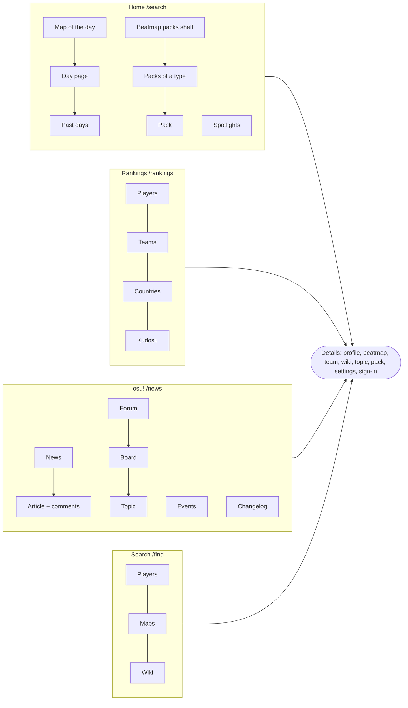
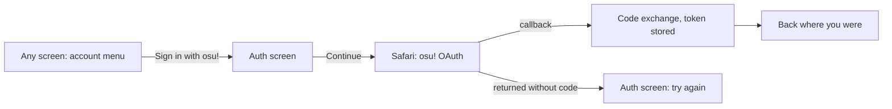
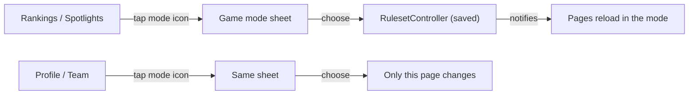
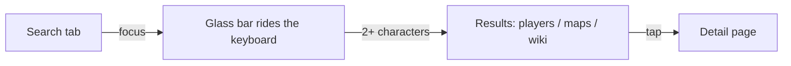
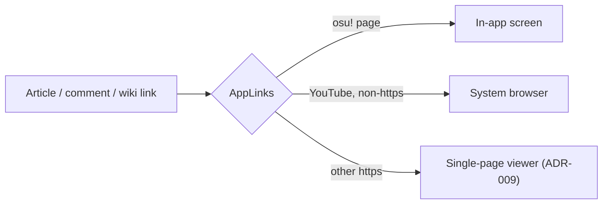
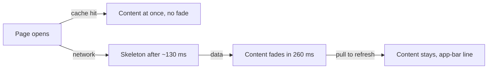

# Tracksu flows

Rendered on GitHub from Mermaid; the same flows are a board in
`tracksu-design.html` and in the Figma file.

## Navigation map (ADR-010)

## Sign in

## Game mode (ADR-011)

## Search

## Links inside content

## Loading

